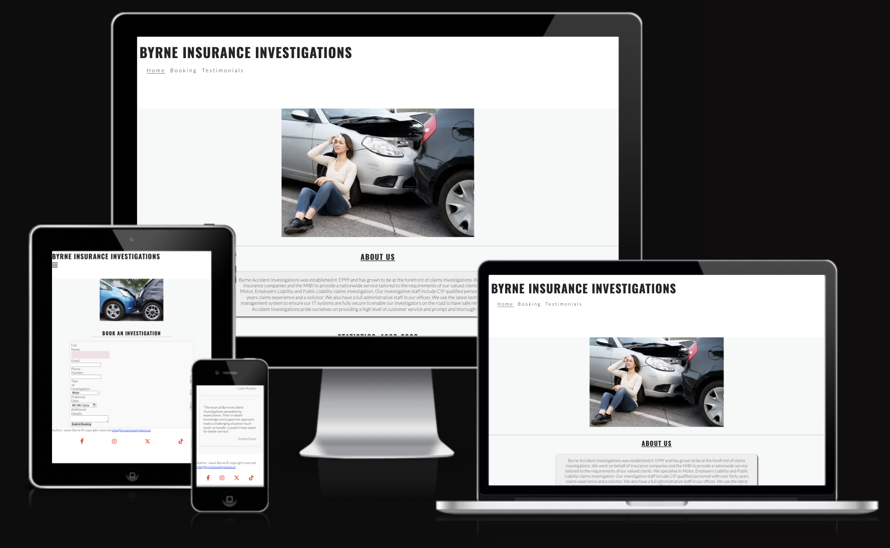

# Byrne Insurance Investigations Website


<strong>To view the live site click the link:</strong> https://jb060.github.io/byrnes-insurance-investigations-2/

<p>Welcome to the Byrne Insurance Investigations website repository. This project includes three main web pages: Home, Booking, and Testimonials. The website serves as a platform for clients to learn about our services, book investigations, and read testimonials.</p>

## Table of Contents

- [Byrne Insurance Investigations Website](#byrne-insurance-investigations-website)
  - [Table of Contents](#table-of-contents)
  - [Project Overview](#project-overview)
  - [Pages and Features](#pages-and-features)
    - [1. Home Page (`index.html`)](#1-home-page-indexhtml)
      - [Description](#description)
      - [Key Features](#key-features)
      - [HTML Structure](#html-structure)
    - [2. Booking Page (`booking.html`)](#2-booking-page-bookinghtml)
      - [Description](#description-1)
      - [Key Features](#key-features-1)
      - [HTML Structure](#html-structure-1)
    - [3. Testimonials Page (`testimonials.html`)](#3-testimonials-page-testimonialshtml)
      - [Description](#description-2)
      - [Key Features](#key-features-2)
      - [HTML Structure](#html-structure-2)
  - [Directory Structure](#directory-structure)
  - [Contributing](#contributing)
  - [Bugs Squashed](#bugs-squashed)
    - [Index Page (`index.html`) Bugs](#index-page-indexhtml-bugs)
    - [Booking Page (`booking.html`) Bugs](#booking-page-bookinghtml-bugs)
    - [Testimonials Page (`testimonials.html`) Bugs](#testimonials-page-testimonialshtml-bugs)
    - [Additional Minor Bugs](#additional-minor-bugs)
  - [Getting Started](#getting-started)
    - [Prerequisites](#prerequisites)
    - [Installation](#installation)
  - [Technologies Used](#technologies-used)


## Project Overview

The Byrne Insurance Investigations website provides information on our insurance investigation services. The website is designed to be responsive, user-friendly, and informative, featuring essential sections and forms to facilitate client interactions.

## Pages and Features

### 1. Home Page (`index.html`)

**Description:**
The home page introduces Byrne Insurance Investigations, highlighting our expertise in motor, public, and employer's liability claims.

**Key Features:**
- Welcome message with a brief description of our services.
- Centralized heading with a horizontal line for visual separation.

**HTML Structure:**
- `<header>`: Logo and navigation menu.
- `<main>`: Introduction section with text content.
- `<footer>`: Contact information and social media links.

### 2. Booking Page (`booking.html`)

**Description:**
The booking page allows clients to schedule an investigation by filling out a form with their details and preferences.

**Key Features:**
- Centralized heading with a horizontal line for visual separation.
- Form for booking an investigation, including fields for name, email, phone, investigation type, preferred date, and additional details.
- Form submission via POST method to a designated URL.

**HTML Structure:**
- `<header>`: Logo and navigation menu.
- `<main>`: Booking form.
- `<footer>`: Contact information and social media links.

### 3. Testimonials Page (`testimonials.html`)

**Description:**
The testimonials page showcases feedback from our clients, demonstrating the value and effectiveness of our services.

**Key Features:**
- Centralized heading with a horizontal line for visual separation.
- Client testimonials displayed with names and feedback messages.

**HTML Structure:**
- `<header>`: Logo and navigation menu.
- `<main>`: Testimonials section.
- `<footer>`: Contact information and social media links.

### **Directory structure:**
 section of each page.

By addressing these bugs, the website now offers a more consistent, responsive, and user-friendly experience across all pages.

## Getting Started

### Prerequisites

Ensure you have the following:
- A web browser (e.g., Chrome, Firefox, Edge).
- Basic understanding of HTML and CSS.

### Installation

1. **Clone the Repository:**

   ```bash
   git clone https://github.com/yourusername/byrne-investigations.git

### Technologies Used in the project
   
## HTML
-Used to structure the content of the website.
-Elements like headings, paragraphs, forms, images, and links were created using HTML.

## CSS
- Applied for styling the website, including layout, colors, fonts, and responsive design.
- Flexbox and CSS Grid were used to create responsive and flexible layouts.
- Media queries were employed for responsive adjustments across different screen sizes.
- Integrated for interactive features such as the responsive navigation menu.
- Utilized for form validation and dynamic updates (if any future enhancements were to be added).

## FormDump (Form Handling)
- Form Submission Service: Utilized https://formdump.codeinstitute.net to handle form submissions for the booking form.

## Font Awesome
- Included for the social media icons and navigation toggle icon.
- Used the Font Awesome kit (https://kit.fontawesome.com/eb8e6c55dd.js) to integrate the icons.

## Google Fonts
- Used for the website typography to ensure consistent and aesthetically pleasing text.

## Modern Browser APIs
- HTML5 and CSS3 standards were used to leverage modern browser capabilities like HTML5 input types, CSS transitions, and flexbox layouts.

## Favicon Generator
- Favicons for the website were created using a favicon generator to provide support for various devices and browsers.
- Integrated different sizes and formats for comprehensive support.

## VS Code (Code Editor)
- Utilized for coding and managing the project files with various extensions for syntax highlighting, code formatting, and live preview.

## Git & GitHub
- Version control system used to track changes in the codebase and collaborate on code.
- GitHub for hosting the project repository and version management.

## Web Browser Developer Tools
- Used for debugging and testing the website across different browsers and devices.
- Tools like Chrome DevTools for inspecting elements, adjusting CSS, and testing responsive layouts.

## Accessibility and SEO Tools
- Ensured accessibility by including alt attributes for images and using semantic HTML elements.
- Meta tags for SEO to improve search engine visibility and content description.

## W3C Validation Tools
- Used HTML and CSS validators to check the code for compliance with web standards and to ensure there were no syntax errors.
- Breakdown by Page:
- index.html:

### Deployment
## GitHub Pages Deployment
Push Code to GitHub: Ensure all changes are committed and pushed to the main branch of the repository.


1. Follow these steps to deploy the site on GitHub Pages:
   -git add .
    git commit -m "Prepare for deployment"
    git push origin main
   
2. Set Up GitHub Pages:
 - Go to the repository on GitHub.
 - Navigate to Settings > Pages.
 - In the Build and deployment section, select Deploy from a branch.
 - Choose the main branch and /root folder for deployment.

3. Verify Deployment:
 - Wait a few minutes for GitHub Pages to deploy the site.
 - Visit the live site URL (e.g., https://yourusername.github.io/byrne-investigations/) to confirm the deployment.

### Updating the Site:
1. Make Changes Locally: Modify the code as needed.
2. Commit and Push: Commit changes and push to the main branch.
3. GitHub Pages Auto-Deploy: GitHub Pages will automatically redeploy the site with the latest changes.

### Rollback
## To roll back to a previous version:
 - Revert to a previous commit in the repository and push the changes.
 - GitHub Pages will redeploy the reverted version.

### Manual Testing
## Test Class
Testing is critical to ensure the website functions correctly across different scenarios. Here are the manual test cases performed:

1. Navigation Links:
   - Objective: Verify all navigation links work correctly.
   - Steps:
      - Click on each navigation link (Home, Booking, Testimonials).
      - Confirm that each link directs to the correct page.
   - Expected Result: Each navigation link should lead to the respective page without errors.

2. ## Form Submission (Booking Page):
 - Objective: Ensure the booking form submits correctly.
 - Steps:
   - Fill out the form fields with valid data.
   - Click the "Submit" button.
 - Expected Result: The form should be submitted successfully and show a confirmation message or redirect.

3. ## Responsive Design:
  - Objective: Confirm the site layout adapts to different screen sizes.
  - Steps:
    - Resize the browser window or use device simulation in developer tools.
    - Check the layout and functionality on desktop, tablet, and mobile views.
  - Expected Result: The layout should be responsive and elements should be well-aligned on all screen sizes.

4. ## Content Accessibility:

 - Objective: Ensure all content is accessible.
 - Steps:
   - Verify alt text for images.
   - Use a screen reader to navigate through the website.
 - Expected Result: All images should have alt text and the screen reader should provide meaningful descriptions.

5. ## Link Validation:

 - Objective: Ensure all external and internal links are functional.
 - Steps:
   - Click on each link (social media, internal links).
   - Confirm that the link opens the correct destination.
 - Expected Result: Links should navigate to the correct destination or open in a new tab as expected.

7. Image Display:

 - Objective: Verify all images load correctly.
 - Steps:
  - Load each page and observe the images.
- Expected Result: All images should be displayed correctly without broken links.

### Tools Used for Testing
 - Browser Developer Tools: For inspecting elements and testing responsive design.
 - Screen Readers: To test accessibility.
 - Validator Tools: To ensure HTML and CSS comply with standards (e.g., W3C Validator).


HTML for structure.
CSS for styling and layout.
JavaScript for interactive navigation.
Font Awesome for social media icons.
Favicon Generator for icons.
booking.html:

HTML for form structure.
CSS for form styling and layout.
JavaScript for form validation.
FormDump for handling form submissions.
Font Awesome for icons.
testimonials.html:

HTML for testimonials structure.
CSS for layout and styling.
JavaScript for any potential future interactive elements.
Font Awesome for icons.
Together, these technologies helped build a responsive, accessible, and user-friendly website for Byrne Insurance Investigations.

### Credits
This project was made possible through the contributions and support of various individuals and resources:

- Marcel (Mentor)

  - To provide invaluable guidance, feedback, and support throughout the development process.
    
- Font Awesome
  - To provide icons used across the site.
    
- Google Fonts
  - For the typography used in the project.
    
- Code Institute
  - For the form submission service (FormDump).
 
- Unsplash/Pexels
  - For any images used in the project.
    
- W3C
  - For HTML and CSS validation tools.

     
- Community Contributors
  - For any feedback and contributions to the project.

